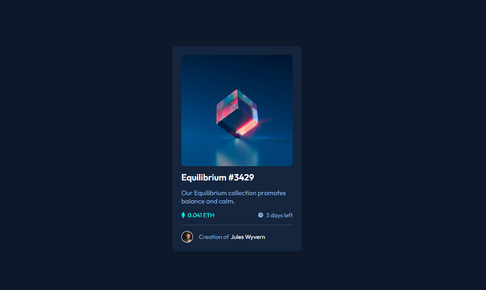
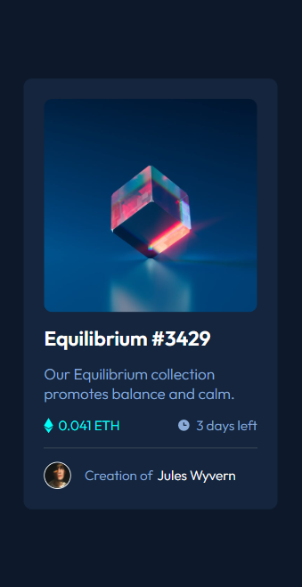

# Frontend Mentor - NFT preview card component solution

This is a solution to the [NFT preview card component challenge on Frontend Mentor](https://www.frontendmentor.io/challenges/nft-preview-card-component-SbdUL_w0U). Frontend Mentor challenges help you improve your coding skills by building realistic projects.

### Finished Project

Desktop preview :

 </img>

Mobile preview :

 </img>

### Links

- Solution URL: [Solution](https://mthsimao.github.io/nft-card/)

### Built with

- Semantic HTML5 markup
- CSS custom properties
- Flexbox

## Author

- Website - [Matheus Simão](https://www.mthsimao.github.io/portfolio)
- Frontend Mentor - [@mthsimao](https://www.frontendmentor.io/profile/mthsimao)
